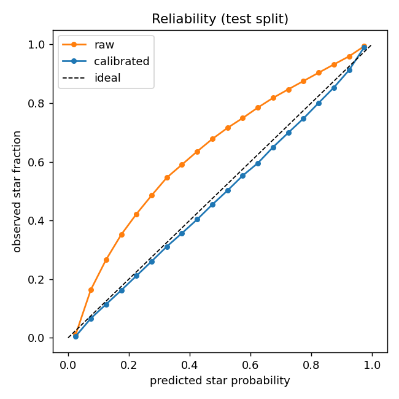
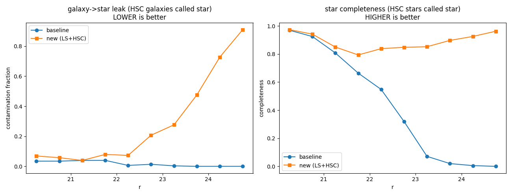
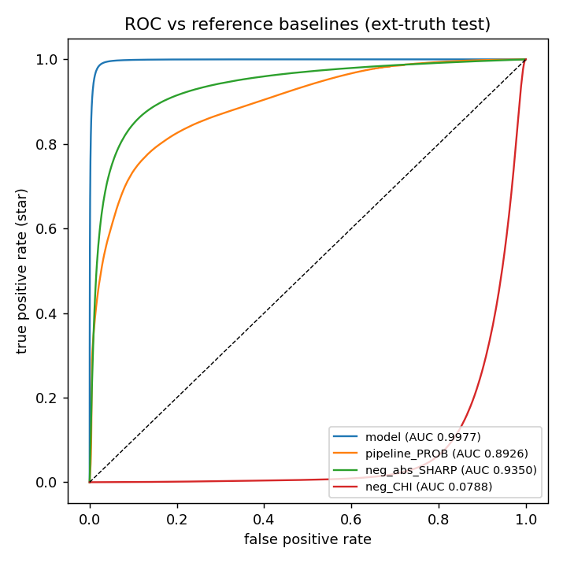
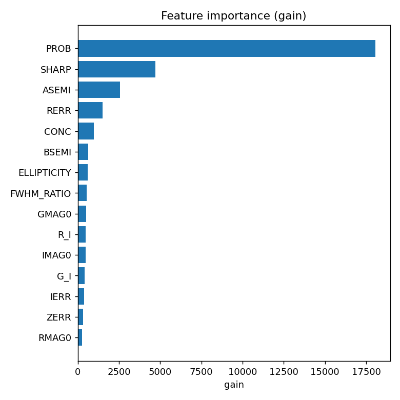

# morphocloud

A reliable **star/galaxy classifier for the DELVE-MC survey**. morphocloud produces a
calibrated *stellar probability* for each source from catalog photometry and morphology
alone — no images, no external catalog at inference time — so it runs anywhere the
DELVE-MC (y4t2) brick catalogs are present.

The current deliverable is **Tier 1**: a gradient-boosted decision tree (XGBoost) baseline
with calibrated probabilities. It is the strong, fast, releasable starting point, ahead of
any image-based or foundation-model work (Tier 2/3).

## What it does

Given a DELVE-MC source, the model returns `P_STAR` ∈ [0, 1], a calibrated probability that
the source is a star (vs. an extended galaxy). Truth-catalog columns are **never** inputs,
so inference depends only on the DELVE-MC catalog itself.

It separates stars from galaxies essentially perfectly at the bright end and stays useful
deep into the faint regime: on independent (HST/Gaia/Legacy-Surveys) truth it reaches
**star purity 0.998 at completeness 0.999 for r < 20.5**, and the faint-end star labels
(see below) extend reliable separation to **r ≈ 23**. It decisively beats the classic
`SHARP` cut (ROC-AUC ≈ 0.90–0.94) and the pipeline `PROB` (≈ 0.89–0.90).

## How the model is calculated

**1. Features (25, catalog-only).** Extinction-corrected `griz` magnitudes (`EBV` × DECam
SFD coefficients) and colours (`g−r`, `r−i`, `i−z`, `g−i`); per-band `ERR`/`SCATTER`;
DAOPHOT/ALLFRAME morphology `CHI`, `SHARP`, the pipeline star/galaxy `PROB`, and shape
parameters (`ELLIPTICITY`, `ASEMI`, `BSEMI`); the coadd `FWHM` normalized by per-brick
seeing (`FWHM_RATIO`) plus the seeing itself; and a per-brick-anchored `MAG_AUTO − PSF`
concentration proxy (`CONC`). `NDET` counts and all provenance flags are **excluded** as
inputs (they encode survey cadence / catalog membership, not morphology). `PROB`, `SHARP`
and the shape/concentration features carry most of the model's gain (see feature importance
below).

**2. Training labels — cross-match to truth.** Each DELVE-MC source is matched (0.5″)
against several truth catalogs, each carrying its own provenance flag so labels can be
ablated or down-weighted:

| source | role | notes |
|---|---|---|
| **Gaia DR3** | stars | clean astrometric point sources; bright/blue-limited (G ≲ 21) |
| **Legacy Surveys DR10** | galaxies **and** stars | `type∈{DEV,EXP,SER}` galaxies; full-depth `PSF` stars (Gaia-forced rows excluded) |
| **DELVE DR3** | stars + galaxies | conservative two-sided `spread_model` cuts — a *teacher*, not truth; never an input feature |
| **HSC v3 (HST)** | galaxies + stars | the only labels inside the MC cores; stars = isolated, point-like sources (0.5″ isolation cut so DELVE-blended pairs are dropped) |
| **Gaia DR3 extragalactic** | galaxies (QSOs: provenance only) | purer-union cuts; MC cores masked |

Conflicting claims (e.g. a DR3 "galaxy" that Gaia/LS call a star) are dropped. **LS PSF is
the deepest star source**, overtaking Gaia past r ≈ 21 and DR3 past r ≈ 21.5 — this is what
gives the model faint-end star labels at all.

**3. Dataset.** Quality cuts (`BRICKUNIQ`, ≥2 good bands), LS artifact-mask regions removed,
and a **spatial** train/val/test split by HEALPix superpixel (no sky overlap between splits)
to measure honest generalization. ≈ 169 M labelled rows.

**4. Training.** XGBoost histogram GBDT (`max_depth=8`, `eta=0.3`, `scale_pos_weight` for
class balance), early-stopping on the spatial val split. It trains **out-of-core**: pass
`--dmatrix extmem` (default; bins each batch to an on-disk cache, bounds RAM) or
`--dmatrix incore` (whole binned matrix in RAM — faster when RAM ≫ dataset).

**5. Calibration.** Raw GBDT scores are not probabilities; an **isotonic** map fit on the
val split turns them into calibrated `P_STAR` (`P_STAR = np.interp(raw, x, y)`). This brings
the reliability curve onto the ideal diagonal:



## Evaluation

All metrics are on the held-out, spatially-disjoint **test** split; the faint-end figure
uses **independent HST (HSC) truth** that the model never trained on in those fields.

**Faint end — the headline.** Gaia runs out at r ≈ 21, so a Gaia-only baseline silently
*gives up* on faint stars (it labels nearly everything faint a galaxy → star completeness
→ 0 past r ≈ 23). Adding the LS + HSC faint star labels fixes this: the new model holds
high star completeness and has **higher ROC-AUC at every faint magnitude**. The cost, at a
naïve 0.5 threshold, is galaxy leakage into the star class at the very faint end — addressed
by the operating-point choice discussed under *Caveats* below.



At a **fixed 95 % star purity** (the fair, threshold-independent comparison) the faint-end
completeness gain is real where stars are recoverable, e.g. r ≈ 22.25: **0.93 vs 0.79**.

**Overall discrimination & drivers:**

 

Reference baselines on the same data: `SHARP` cut ROC-AUC ≈ 0.90–0.94, pipeline `PROB`
≈ 0.89–0.90; on the DELVE DR3 cross-match overlap the classic
`|spread_model| < 0.003 + spreaderr_model` cut is the external comparison. Full numbers,
per-colour/seeing breakdowns and biases are in [`docs/model_card.md`](docs/model_card.md).

## Caveats & confidence intervals

**Where to trust `P_STAR`:**

- **r ≲ 20.5 — gold.** Purity ≈ 0.998, completeness ≈ 0.999 against independent truth,
  across colour and seeing.
- **20.5 ≲ r ≲ 23 — reliable, but tune the threshold.** Separation is strong (the model
  beats the baseline and the classic cuts here), but the released probabilities sit on a
  **star-heavy base rate** (≈ 76 % of training labels are stars), so a flat `P_STAR > 0.5`
  *over-calls* stars at the faint end. **Use a magnitude- (ideally magnitude×seeing-)
  dependent threshold** for a target purity — e.g. ~0.94 calibrated probability buys ~99 %
  star purity globally. A flat 0.5 cut is fine bright-ward, not faint-ward.
- **r ≳ 23.5 — low confidence.** Point-like compact galaxies are not separable from stars
  with catalog features at this depth (the DECam ground-based resolution floor), and there
  is **no independent faint star truth** in/near the MCs to validate against, so faint-end
  purity cannot be externally certified. Treat probabilities here as indicative; consider
  flagging r ≳ 23.5 sources as unclassified for high-purity samples.

**Label provenance caveats:**

- The faint star labels are *teacher* labels, not independent ground truth: **LS DR10 shares
  DECam imaging** with DELVE-MC (so LS PSF morphology is correlated with our features), and
  **HSC isolated point sources carry ~27 % compact-galaxy contamination** that no CI or
  colour cut removes. **DELVE DR3** labels are distilled `spread_model` cuts. All three carry
  provenance flags and are down-weightable / ablatable.
- **Selection biases:** HST pointings oversample dense fields/clusters; Legacy-Surveys and
  DR3 are blind in the MC cores (Gaia and HSC carry those); galaxy labels lean toward the
  periphery. The crowded MC cores (`IN_MC_CORE`) are carried through for separate evaluation.

`QUALITY_PASS` (≥2-good-band detection) marks the regime the model was trained under; sources
that fail it still receive a probability but lie outside the validated range.

## Installation

Requires Python ≥ 3.11. From the repo root:

```bash
conda create -n morphocloud python=3.11
conda activate morphocloud
pip install -e .          # add ".[dev]" for pytest + ruff
```

> On macOS, XGBoost needs OpenMP: `conda install llvm-openmp`.

Two things inference needs that are **not** in the repo:
- **The DELVE-MC y4t2 brick catalogs** (object FITS files). Their location is set in
  [`src/morphocloud/config.py`](src/morphocloud/config.py) (`DELVEMC_DATA`).
- **The trained model artifacts** (`*.json`, `*.meta.json`, `*.calibrator.json`; gitignored —
  obtain the released weights, or reproduce them with the pipeline below).

## Usage — classify a brick

```python
from morphocloud.infer import StarGalaxyClassifier

clf = StarGalaxyClassifier.load()        # loads model + isotonic calibrator
df = clf.classify_brick("0002m587")      # one row per source
```

```bash
python scripts/predict_brick.py 0002m587 --out-dir preds/          # FITS
python scripts/predict_brick.py 0002m587 0003m587 --format parquet
```

Output columns: `BRICKNAME`, `OBJID`, `RA`, `DEC`, `BRICKUNIQ`, `P_STAR` (calibrated),
`P_STAR_RAW`, and `QUALITY_PASS`.

## Reproducing the pipeline

```bash
# 1. fetch truth labels by sky tile (Gaia DR3, LS DR10 galaxies + PSF stars,
#    DELVE DR3, HSC v3, Gaia extragal)
python scripts/fetch_labels.py gaia_dr3        # ... and the other sources

# 2-3. assemble the labelled, quality-cut, spatially-split dataset
python scripts/build_dataset.py --jobs 10 && python scripts/build_dataset.py merge

# 4. train the out-of-core XGBoost model (extmem default; incore for big-RAM hosts)
python scripts/train_baseline.py --threads 10 --dmatrix extmem | tee logs/train.log

# 5-6. calibrate (isotonic) + evaluate on the held-out test split  -> reports/
python scripts/evaluate_baseline.py --model models/baseline_xgb.json
python scripts/evaluate_faint_hst.py           # faint-end vs baseline on HSC truth
```

Labels are streamed/fetched on demand by sky chunk — the DELVE-MC catalog is never copied
(local storage budget ~100 GB).

## Repository layout

| Path | Contents |
|---|---|
| `src/morphocloud/` | package: brick readers, features, label assembly, dataset, TAP clients, inference |
| `scripts/` | CLIs: `fetch_labels`, `build_dataset`, `train_baseline`, `evaluate_baseline`, `evaluate_faint_hst`, `predict_brick` |
| `docs/plan.md` | Tier 1 plan, data conventions, locked decisions |
| `docs/model_card.md` | model card: intended use, training data, biases, evaluation, limitations |
| `docs/figures/` | evaluation figures shown above |
| `tests/` | unit tests (`pytest`) |
| `models/`, `reports/`, `data/` | model artifacts, evaluation outputs, datasets (all gitignored) |

## Status & roadmap

Tier 1 (catalog-based GBDT baseline) is complete: dataset → training → calibration →
evaluation → packaging, now including LS DR10 PSF and HSC isolated-source **faint star
labels**. Open items: a per-magnitude operating-threshold table for release, and a
DR3-distillation ablation. Tier 2/3 (image-based and foundation-model classifiers) are
future work.

## License

[MIT](LICENSE).
