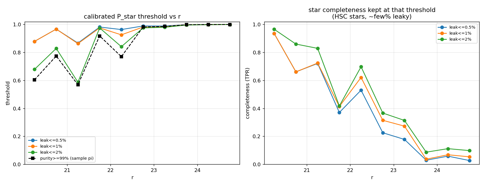

# Model card — morphocloud star/galaxy classifier

**Model:** `models/baseline_lshsc_xgb.json` (+ `.meta.json`, `.calibrator.json`)
**Version:** 1.0.0 — faint-end star labels, trained 2026-06-14
**Type:** Gradient-boosted decision trees (XGBoost, `binary:logistic`) with isotonic
probability calibration
**Output:** `P_STAR` ∈ [0, 1] — calibrated probability that a DELVE-MC source is a star

> Supersedes the Gaia-only `baseline_xgb` model. The change in this version is the addition
> of **faint-reaching star labels** (Legacy Surveys DR10 PSF + HSC isolated point sources),
> which fixes the baseline's collapse on faint stars past r ≈ 23 (§6.1). It is a better
> faint-end *discriminator*; realising that gain in a sample requires a magnitude-dependent
> operating threshold (§6.2).

---

## 1. Intended use

Produce a calibrated stellar probability for DELVE-MC DR1 catalog sources from
**catalog photometry and morphology alone**, for fast star/galaxy separation across the
DELVE-MC footprint.

- **In scope:** point-source vs extended classification of DELVE-MC sources that pass
  the quality cut (≥2 of g/r/i detected with err < 0.5), in the magnitude/colour/seeing
  range where the model is validated (§6).
- **Out of scope:** physical QSO/AGN identification (QSOs are point sources here and are
  *not* separated); sources fainter than the validated regime (r ≳ 23.5); surveys other
  than DELVE-MC DR1 without re-validation.

Inference reads **only DELVE-MC columns** (object catalog + per-brick exposure
metadata). No truth catalog — including DELVE DR3 — is ever an input.

## 2. Inputs / features (25)

Derived in `morphocloud.features.brick_features`:

- **Photometry:** extinction-corrected `g,r,i,z` mags (`*MAG0`, using the catalog `EBV`
  and DES Fitzpatrick-99 coefficients), per-band `ERR`, `SCATTER`; colours `g−r, r−i,
  i−z, g−i`.
- **Morphology:** `CHI`, `SHARP`, pipeline `PROB`, `ELLIPTICITY`, `ASEMI`, `BSEMI`;
  `FWHM_RATIO` (coadd FWHM ÷ per-brick seeing); `SEEING`; `CONC` (MAG_AUTO − PSF
  concentration, per-brick anchored on bright point sources).

`PROB`, `SHARP`, and the shape/concentration features carry most of the model's gain
(`docs/figures/feature_importance.png`).

**Deliberately excluded as inputs:** `NDET{g,r,i,z}` (an observation count = survey
cadence/depth/footprint geometry, not a source property — used only for the quality
cut) and all truth-provenance flags (would leak catalog membership). Missing values are
kept as NaN and routed natively by XGBoost.

## 3. Training data & label provenance

≈ 169 M quality-cut, labelled DELVE-MC sources (`data/train/dataset.parquet`; star
fraction ≈ 0.72). Labels are a conflict-free consensus of:

| Source | Vote | Notes / bias |
|---|---|---|
| Gaia DR3 (high-conf. point sources) | star | **bright/blue-limited (G ≲ 21)**; independent |
| LS DR10 (`tractor`, `type∈{DEV,EXP,SER}`) | galaxy | absent/Gaia-forced inside the MC cores |
| **LS DR10 (`type=PSF`, full depth, Gaia-forced excluded)** | **star** | **deepest star source** (overtakes Gaia past r≈21, DR3 past r≈21.5); *teacher*, shares DECam imaging with DELVE-MC |
| **HSC v3 (HST), isolated point sources** | **star** | only in-MC labels; 0.5″ isolation cut drops DELVE-blended pairs; **~27 % residual compact-galaxy contamination** that no CI/colour cut removes |
| HSC v3 (HST), `ci>1.6` | galaxy | only galaxy source inside the MCs; shreds big galaxies → galaxy-only; per-brick conflict-rate QC |
| Gaia DR3 extragalactic (I/356, "purer" unions) | galaxy | bright-biased, mostly redundant outside cores; QSO table is provenance-only, never a vote |
| DELVE DR3 `spread_model` (two-sided high-S/N cut) | star **and** galaxy | **distilled classifier, not truth** |

Sources in LS DR10 artifact-mask regions (bright-star ghosts/saturation) are excluded.
Conflicting and unlabelled sources are dropped (e.g. a DR3 "galaxy" that LS/Gaia call a
star — adding LS PSF as a star vote now catches more of these). Per-source provenance
flags are retained in the dataset (for ablation/eval) but never used as features.

**Known label biases:** the faint star labels are **teacher labels, not independent
truth** — LS PSF morphology is correlated with our features (shared DECam imaging) and
HSC point-like selection carries compact-galaxy contamination; DR3 distils another
classifier. There is **no independent faint star truth** in/near the MCs, so faint-end
star purity cannot be externally certified (§6.1). HST pointings oversample dense fields;
galaxy labels lean toward the periphery.

## 4. Training procedure

- Out-of-core: an XGBoost `DataIter` streams the 169 M-row parquet. `--dmatrix extmem`
  (default) bins each batch to an on-disk page cache (RAM bounded, regardless of table
  size); `--dmatrix incore` keeps the whole binned matrix in RAM (faster when RAM ≫
  dataset). `tree_method=hist`, `max_depth=8`, **`eta=0.3`** (XGBoost default; 0.1
  converged too slowly), `subsample=0.8`, `colsample_bytree=0.8`, `min_child_weight=20`,
  `max_bin=256`.
- Class imbalance: `scale_pos_weight = n_gal/n_star ≈ 0.39` (positive class = star; the
  set is now star-heavy — see §6.2).
- 400 boosting rounds, early-stopping (patience 30) on the **spatially disjoint** val
  split (final run reached the cap at iter 396; AUC saturated by ~round 150).
- **Splits are by sky region** (HEALPix nside=16 superpixels), not i.i.d., to prevent
  spatial leakage: train ≈ 116 M / val ≈ 28 M / test ≈ 25 M. **Read metrics stratified by
  magnitude/colour/seeing, not as i.i.d. accuracy.**

## 5. Calibration

Isotonic regression fit on the val split (raw score → observed star fraction),
serialized as interpolation knots in `baseline_lshsc_xgb.calibrator.json`. Runtime
application is `np.interp(raw, x, y)` — no sklearn dependency. It corrects the
`scale_pos_weight` tilt (val Brier 0.0325 → 0.0284; test calibrated Brier 0.026 full /
0.028 external) and brings the reliability curve onto the diagonal. Calibration is
monotonic, so it does **not** change the star/galaxy ranking or fix the operating-point
issue in §6.2.


## 6. Evaluation (held-out, spatially-disjoint test split, ≈ 25 M sources)

Because the test label is partly distilled from DR3, aggregate metrics are reported on
both the **full** test set and the **external-truth** subset (rows with a Gaia/LS-galaxy/
HSC-galaxy vote).

| Metric | Full | External-truth |
|---|---|---|
| Model ROC-AUC | 0.990 | 0.998 |
| Model PR-AUC | 0.996 | 0.999 |
| Pipeline `PROB` ROC-AUC | 0.891 | 0.893 |
| Classic `−\|SHARP\|` ROC-AUC | 0.902 | 0.935 |
| Calibrated Brier | 0.026 | 0.028 |

The model decisively beats the pipeline `PROB` and the classic `SHARP` cut; `CHI` alone
is non-discriminative (expected — a goodness-of-fit statistic). **Bright end (r < 20.5,
independent truth): star purity 0.998 at completeness 0.999.** For a high-purity sample,
the calibrated threshold for **99 % star purity** is ≈ 0.94 (full; → 91 % completeness)
or ≈ 0.96 (external; → 99 % completeness). Full tables: `reports/eval_summary.json`,
`reports/purity_completeness.csv`.

 

### 6.1 Faint end — validated against independent HST truth

The point of this model version. Evaluated on **HSC (HST) classifications** the model
never trained on in those fields (`scripts/evaluate_faint_hst.py`,
`docs/figures/faint_hst_eval.png`), comparing against the Gaia-only baseline on the
*same* held-out sources:

- The Gaia-only baseline silently **gives up on faint stars** — star completeness → 0.07
  at r ≈ 23.25, → 0 by r ≈ 24 (Gaia, its only faint star teacher, has run out).
- The new model holds **star completeness ≈ 0.78–0.92** through r ≈ 24 and has **higher
  ROC-AUC in every faint magnitude bin** (e.g. r ≈ 22.75: 0.91 vs 0.88; r ≈ 23.75: 0.81
  vs 0.77).
- At a **fixed 95 % star purity** (threshold-independent), faint completeness improves
  where stars are recoverable, e.g. **r ≈ 22.25: 0.93 vs 0.79**.


**Validity ranges:**

| regime | status |
|---|---|
| **r < 20.5** | **gold** — purity 0.998 / completeness 0.999 vs independent truth, robust across colour & seeing |
| **20.5 ≲ r ≲ 23** | **reliable with a magnitude-dependent threshold** (§6.2); beats the baseline and the classic cuts |
| **r ≳ 23.5** | **low confidence** — point-like compact galaxies are not separable from stars with catalog features (DECam ground resolution floor), and there is no independent faint star truth to certify purity. Consider flagging as unclassified for high-purity samples. |

> Caveat on the eval's *external-truth* faint bins: external star truth is Gaia, which
> ends at r ≈ 21, so past there the external subset is ~pure galaxies and its "star
> purity" collapses as an **artifact** (no stars to be right about), not a model failure.
> Only the HSC-truth eval above is valid faint-ward.

### 6.2 Operating point — use a magnitude-dependent threshold

The training set is now **star-heavy (≈ 72 % stars)**, so calibrated `P_STAR` sits on a
high base rate and a flat `P_STAR > 0.5` **over-calls stars at the faint end** (at p≥0.5,
faint galaxy→star leak grows past r ≈ 23). The fix is a **magnitude-dependent threshold**:
`scripts/build_threshold_table.py` tabulates, per r-mag bin, the calibrated-`P_STAR`
threshold that meets a chosen target on the held-out HSC-truth sample (test split,
outside the MC cores) → `reports/threshold_table.csv`.



Two threshold families are tabulated:

- **Leak-controlled (recommended, base-rate-robust):** the threshold capping the
  galaxy→star leak — the fraction of true (HSC) galaxies called star, i.e. the false
  positive rate — at 0.5 / 1 / 2 %. This rests only on the **reliable** HSC galaxy truth
  and is independent of the star:galaxy mix, so it transfers to the real catalog.
- **Purity-target:** the threshold reaching 95 / 99 % star purity *on the eval sample*.
  Because purity = TP/(TP+FP) depends on the base rate and this HSC selection is
  star-heavy, these are the **test-set** operating points; for a catalog bin with star
  fraction π, recover purity from the leak columns via
  `purity(π) = π·TPR / (π·TPR + (1−π)·FPR)` (TPR = the tabulated completeness, FPR = the
  leak target).

Headline operating point — **galaxy→star leak ≤ 1 %** (≈ 99 % star purity near a balanced
base rate). The star completeness it preserves falls steeply faint-ward — that is the
physical limit, not a tuning artifact:

| r bin | `P_STAR` threshold (leak ≤ 1 %) | star completeness kept |
|---|---|---|
| r < 20.5 | flat 0.5 (model ≈ 0.998 pure) | ≈ 1.00 |
| 21.0–21.5 | ≈ 0.86 | 0.72 |
| 22.0–22.5 | ≈ 0.93 | 0.62 |
| 22.5–23.0 | ≈ 0.98 | 0.31 |
| 23.0–23.5 | ≈ 0.98 | 0.27 |
| 23.5–24.0 | ≈ 1.00 | 0.04 |

So past r ≈ 23 a high-purity star sample keeps only a small, bright-biased fraction of the
true stars; below that, demanding star purity means accepting near-zero completeness
(DECam resolution floor, §6.1). Bright-ward (r < 20.5) the flat 0.5 cut is appropriate.

> Caveat — the per-bin numbers come from a few hundred HSC galaxies each (so individual
> thresholds are noisy at the ~0.05 level), HSC *star* truth is ~few % galaxy-leaky (the
> reported completeness is therefore a slight under-count), and the implied-purity base
> rate `pi_catalog` carried in the CSV is a **test-split proxy** (itself partly DR3-
> distilled faint-ward), **not** a measured catalog rate. Treat the table as the operating
> guide and the leak-controlled columns as the trustworthy ones.

### 6.3 On the DR3 `spread_model` reference baseline

A direct DR3 comparison on this dataset reads purity = completeness = 1.000, an
**artifact** of conflict-dropping (DR3 and the external catalogs are forced to agree on
surviving rows). Not informative; a real comparison requires the dropped-conflict rows.

## 7. How to run inference

Inference is path-free and input-agnostic: build the features from any DELVE-MC catalog
table (pandas `DataFrame`, astropy `Table`, or numpy structured array) and score it.

```python
from morphocloud.features import engineer_features   # path-free feature builder
from morphocloud.infer import StarGalaxyClassifier
clf = StarGalaxyClassifier.load("baseline_lshsc_xgb.json")   # model + calibrator + table

feats = engineer_features(catalog, seeing=1.1)               # seeing in arcsec
p_star = clf.predict(feats)                                  # calibrated P(star)
threshold_for = clf.smooth_threshold(operating_point="leak1")  # smooth T(r) cut
star = p_star >= threshold_for(feats["RMAG0"].to_numpy(), flat=0.5)
```

`smooth_threshold` fits the per-magnitude operating-point table (§6.2) to a smooth curve in
logit space and returns `threshold_for(rmag0, strictness=0.0, flat=None)` (a `strictness`
dial tightens/loosens the cut everywhere); `threshold_for(rmag0, target=…)` is the raw
step-table lookup. **For a high-purity sample always cut on this magnitude-dependent
threshold rather than a flat `P_STAR > 0.5` (§6.2).**

For local on-disk bricks (with `MORPHOCLOUD_DELVEMC_DATA` set) there is a convenience path:
`clf.classify_brick("0002m587")` and the CLI `python scripts/predict_brick.py BRICK [BRICK …]
--out-dir preds/` (`--format fits|parquet`). Output carries `RMAG0`, `P_STAR` (calibrated),
`P_STAR_RAW`, `BRICKUNIQ`, and `QUALITY_PASS` (the ≥2-good-band training cut — rows that fail
it still get a probability but lie outside the validated regime).

## 8. Limitations

- **Faint star labels are teacher labels, not independent truth:** LS PSF shares DECam
  imaging with DELVE-MC; HSC isolated point sources carry ~27 % compact-galaxy
  contamination (not separable by CI or colour); DR3 distils another classifier. Faint
  star purity therefore cannot be externally certified.
- **Resolution floor at r ≳ 23.5:** catalog features cannot separate point-like compact
  galaxies from stars at this depth — fundamentally an image-based problem, outside the
  scope of a catalog-only classifier.
- **Operating threshold is magnitude-of-r only** (§6.2): seeing and colour dependence are
  not folded into the table, and the per-bin thresholds are HSC-statistics-limited
  (~few hundred galaxies/bin) with a test-split base-rate proxy.
- **MC cores are under-masked** for artifacts (LS is Gaia-forced-only there), and there is
  **no dedicated artifact/out-of-distribution class** — use the quality flag to gate input.

## 9. Files

The four `baseline_lshsc_xgb.*` weight files are distributed as **v1.0.0 release assets**
(not committed to git); download them and point `StarGalaxyClassifier.load(model_path=…)`
or `MORPHOCLOUD_MODELS_DIR` at them.

| File | Contents |
|---|---|
| `models/baseline_lshsc_xgb.json` | XGBoost model (LS/HSC faint-star-label version) |
| `models/baseline_lshsc_xgb.meta.json` | feature list, params, training counts, best iteration |
| `models/baseline_lshsc_xgb.calibrator.json` | isotonic calibration knots |
| `models/baseline_lshsc_xgb.thresholds.csv` | per-magnitude operating-point threshold table (§6.2) |
| `models/baseline_xgb.*` | previous Gaia-only baseline (kept for comparison) |
| `src/morphocloud/infer.py`, `scripts/predict_brick.py` | inference library + CLI |
| `scripts/train_baseline.py`, `scripts/evaluate_baseline.py` | training, calibration + evaluation |
| `scripts/evaluate_faint_hst.py` | faint-end evaluation vs the baseline on HSC truth |
| `scripts/build_threshold_table.py` | per-magnitude operating-threshold table (§6.2) |
| `reports/threshold_table.csv`, `docs/figures/threshold_table.png` | the threshold table + figure |
| `docs/figures/`, `reports/` | evaluation figures, summaries, curves |
